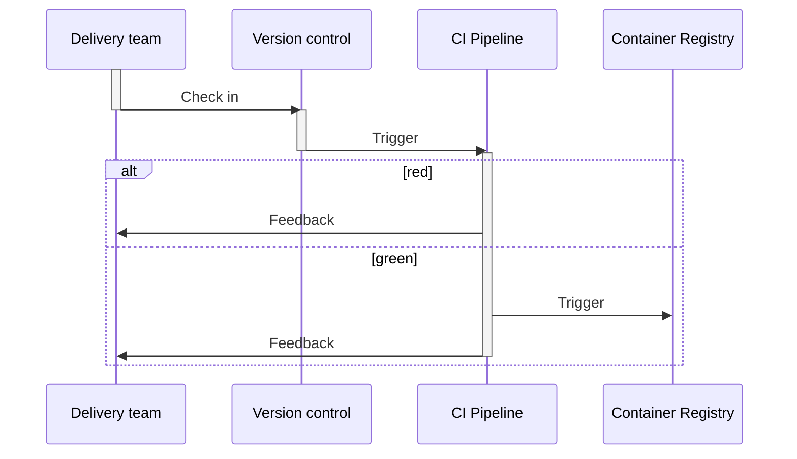

# Opdracht week 3: Continuous Delivery

## Mermaid diagram over de CI pipeline
Toon de gerialiseerde CI integratie als diagram.


```
docker run -d --name gitlab-runner --restart always \
  -v ~/config:/etc/gitlab-runner \
  -v /var/run/docker.sock:/var/run/docker.sock \
  gitlab/gitlab-runner:latest
```
```
docker run -d --name gitlab-runner --restart always   -v ~/config:/etc/gitlab-runner   -v /cert
s/client   gitlab/gitlab-runner:latest
```

De images zijn in de docker registry hier te vinden voor de [app](https://hub.docker.com/repository/docker/kafune/unit-testing-using-dotnet-test-app/general) en de[database](https://hub.docker.com/repository/docker/kafune/unit-testing-using-dotnet-test-postgres/general)
## Theorie opdracht 12factor app

De quote die wij hebben is:
E. *"Wij gebruiken gewoon php's mail() functie. Ik heb even search all gedaan en  als we alle berichten straks via whatsapp willen versturen moeten we de code op 73 plekken aanpassen."*

- A. Welke factor hoort het punt bij?<sup>*</sup> (Geef naam en korte uitleg in eigen woorden)\
 Dit punt hoort bij de factor "Dependencies" (2). php's mail is een dependency (van de standaard php library) dat gebruikt wordt om mails te versturen. 
- B. Is het punt conform de 12factor app regel of gaat het er juist tegen in? (Leg uit, noem evt. tegengestelde punt/voorbeeld)\
  Het is niet conform met de factor. De dependencie is niet geïsoleerd van de applicatie. Als de applicatie veranderd moet de code op 73 plekken aangepast worden. Dit is niet schaalbaar en niet onderhoudbaar.
- C. Ben je het eens met het punt en waarom wel of niet? (Geef evt. voor en tegens)
  - Ja, als een implementatie van een dependency heel vergelijkbaar is, zou het veel handiger zijn om een class toe te voegen die gebruik maakt van de dependency. Zo hoeft er niet op 73 verschillende plekken de code veranderd te worden. Als er dan een nieuwe platform erbij moet komen, dan kan dat toegevoegd worden als een optionele parameter
- D. Welke van de andere 12factors zijn relevant voor deze opdracht? (Welke heb je aan gehouden? Welke zijn verbeterpunten (en hoe)? Bespreek minstens 4 v.d. 12)
  - Codebase
    - Dit project staat in een versiebeheersysteem. Binnen de solutions zitten er verschillende projecten dat wel afhankelijk van elkaar kan zijn, bijvoorbeeld de DAL met de API. Het zou misschien beter zijn als de projecten binnen de solution apart zitten zodat ze apart gedeployed worden. Docker pakt dus met Compose alle projecten bij elkaar, maar als één project niet zou werken, kan de container gewoon niet draaien. 
  - Dependencies
    - Via het .csproj bestand in de verschillende projecten is het mogelijk om alle dependencies expliciet te declareren. Op dit moment maakt de API niet gebruik van een systeem tool om een API call te doen. Dit gebeurt via de OpenAPI package dat ook expliciet gedefinieeërd is.
  - Config
    - De solution maakt gebruik van een aparte .env om Postgres gegevens op te slaan, zodat het Docker compose deze gegevens kan gebruiken om de Oistgres database op te zetten. Het contextbestand binnen PrimeService.DAL maakt geen gebruik van ENV, wat wel beter zou zijn zodat de gegevens niet op meerdere plekken verandert hoeft te worden, en dat de gevoelige gegevens volledig afgeschermd is van Git.
  - Backing service
    - Door met EFCore te werken, is het zelden nodig om de database code aan te passen bij het vervangen van de database. Het werkt nog steeds met dezelfde modellen en syntax om data te manipuleren. Als Postgres eruit zou gaan voor SQLite bijvoorbeeld, dan moet alleen de connectiestring verandert worden.
  - Build, Release, Run
    - D.m.v. de Gitlab pipeline hebben we gecontroleerd of het project nog compileert met de build stage. Zodra het project is compileert en de tests slagen, wordt er binnen de pipeline een image gemaakt die naar de Docker registry wordt gepushed voor de app en de database.
  - Port binding
    - Lokaal is het met Docker containers nodig om de poort in te voeren om de API te benaderen. Als dezelfde containers worden uitgevoerd op een VSP server, is het direct te benaderen door de IP adres in te voeren. De poort is hierbij niet nodig.
