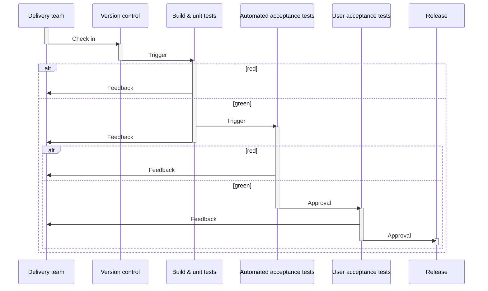

# Opdracht week 3: Continuous Delivery

## Mermaid diagram over de CI pipeline
Toon de gerialiseerde CI integratie als diagram.

## Theorie opdracht 12factor app

De quote die wij hebben is:
E. *"Wij gebruiken gewoon php's mail() functie. Ik heb even search all gedaan en  als we alle berichten straks via whatsapp willen versturen moeten we de code op 73 plekken aanpassen."*

- A. Welke factor hoort het punt bij?* (Geef naam en korte uitleg in eigen woorden)\
 Dit punt hoort bij de factor "Dependencies" (2). php's mail is een dependency (van de standaard php library) dat gebruikt wordt om mails te versturen. 
- B. Is het punt conform de 12factor app regel of gaat het er juist tegen in? (Leg uit, noem evt. tegengestelde punt/voorbeeld)\
  Het is niet conform met de factor. De dependencie is niet geïsoleerd van de applicatie. Als de applicatie veranderd moet de code op 73 plekken aangepast worden. Dit is niet schaalbaar en niet onderhoudbaar.
- C. Ben je het eens met het punt en waarom wel of niet? (Geef evt. voor en tegens)\
  
- D. Welke van de andere 12factors zijn relevant voor deze opdracht? (Welke heb je aan gehouden? Welke zijn verbeterpunten (en hoe)? Bespreek minstens 4 v.d. 12)\
 
